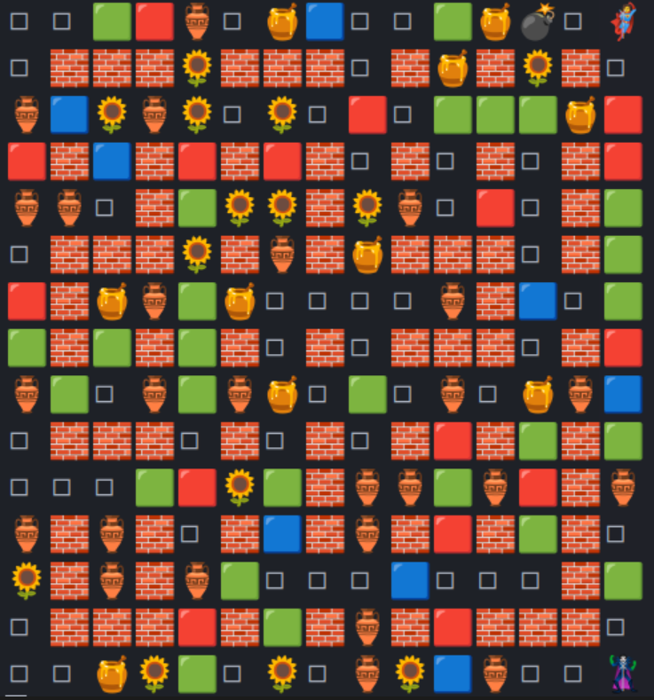

# 2023种子杯赛题

## 2023种子杯：泡泡种子大冒险

### 背景

在一个遥远的神奇世界，存在着一种神奇的种子，被称为“泡泡种子”。这个种子拥有无尽的能量，可以孕育出各种形态各异的泡泡生物。在这个世界里，最勇敢的勇士被称为种子战士。上古时代，一位种子战士在探险过程中发现了一颗巨大的泡泡种子，他立刻被其神秘而美丽的外表所吸引。他将泡泡种子小心翼翼地带回家中。回到家后，他仔细研究了泡泡种子，并发现了种子的秘密：当泡泡种子被人触碰时，它会释放出一股魔力，将周围的空气凝结成泡泡，形成了一个泡泡堂。泡泡堂中的泡泡生物由泡泡种子孕育而生，每个泡泡生物都有不同的特殊能力。而种子战士可以进入泡泡堂中，获得道具，与其他种子战士战斗，变得更强...

### 教学关卡

初来乍到的你，首先对这个世界有了初步认识。这个世界的二维投影是一个15*15的的正方形，由道路、山脉、障碍物组成。你可以沿着道路自由移动，山脉是你无法翻越的，而障碍物是可以使用道具清理掉的。经过一番探索，你发现的信息有：

- 你手中的武器是一种爆炸种子，你可以把他放在道路上，爆炸种子会在一定时间后爆炸，种子爆炸后爆炸范围内的道具会被清理掉，而山脉不会被清理，爆炸范围内的其他生物（**包括你自己**）则会失去生命，被传送出泡泡堂
- 你可以采取的行动有向上下左右四个方向移动和放置爆炸种子，一次可以移动一格或放置一个爆炸种子
- 你手里的爆炸种子的数量是无限的，但是每一块道路上一次只允许放置一颗爆炸种子
- 清理完障碍物后的地块会随机出现其他神奇种子，你可以拾取这些种子以获得各种强力魔法
- 这个世界里还存在另外一个由神奇力量控制的种子战士，他也在不断探索，如果你可以用你的爆炸种子将他清理出这个世界，你将获得丰厚的奖励；反之，如果你被他的爆炸种子清理出去后，你将受到巨大的惩罚。

### 正式探险

作为种子勇士的你，需要编写程序采取合适的策略在这个世界中探险，获得更多的奖励，并尝试击败另一个由神奇力量控制的种子战士，尽量避免死亡。

### 深入理解

我们的冒险基于回合制，每回合你可以行动两次，系统会在每回合计算出当前状态返回给你；你的算法应当在<font color=red>500ms</font>之内完成推理并采取行动，否则将会视为本回合你待在原地没有行动。

初赛游戏时长为1200回合。

### 地图

游戏地图为 $15 \times 15$ 的正方形地图，玩家在地图上可以选择上下左右四个方向进行移动，玩家不能越过存放了障碍物或者爆炸种子的位置。



使用 $i$ 和 $j$ 标记地图的位置，表示地图上的第 $i$ 行第 $j$ 列的位置，注意，游戏地图采用从零开始的标记方式。

### 动作

玩家可以选择移动或者放置爆炸种子。其中移动仅能向上下左右四个方向进行移动，放置爆炸种子的位置默认为当前角色的位置。

<font color=red>进行移动时如果前方有障碍物或者爆炸种子，则不会进行移动。但是两个玩家可以重合在一起。</font>

### 障碍

障碍分为可清除障碍和不可清除障碍，其中不可清除障碍用🧱进行标识，可清除障碍用 🍯、🏺、🌻、🟥、🟩、🟦进行标识

可清除障碍可以被爆炸种子💣破坏，并有一定概率掉落道具。

### 放置爆炸种子

爆炸种子的爆炸范围为上下左右四个方向组成的十字，爆炸范围遇到障碍物则停止扩展。

初始爆炸范围为爆炸种子当前的格子和上下左右四个格子。每获得一个强力药水道具，爆炸范围向四个方向延展一格。

<font color=red>爆炸种子的爆炸时间为5或者6回合。

玩家受到爆炸种子的攻击后血量将会-1。

道具受到爆炸种子的攻击后将会消失。

爆炸种子被另一颗爆炸种子攻击后，将会立即爆炸。</font>

### 人物

#### 属性

玩家的初始爆炸种子为2，每放置一个爆炸种子则玩家持有的爆炸种子数量-1，当自己放置的爆炸种子发生爆炸后，玩家持有的爆炸种子数量+1。玩家获得强力药水道具后，爆炸种子的数量上限+1。

玩家的初始血量上限为1，获得血量恢复道具后血量上限+1，最大血量上限为3，即当玩家的血量为3时，继续获得血量恢复道具并不会增加血量上限。当玩家受到爆炸种子的攻击后，血量-1。血量并不会随着时间自动恢复，当血量减少为0时，玩家游戏失败。

<font color=red>玩家的初始行动速度为2，即一个回合可以采取两个动作</font>，初赛不设置速度相关的道具。

#### 受伤后的护盾时间

当玩家的血量减少时，玩家会获得一定的<font color=red>护盾时间，这个护盾时间为30回合</font>。

### 道具

清除一个可清除障碍后，会有50%的概率掉落随机一种道具。

#### 血量恢复道具💖

玩家获得血量恢复道具后血量上限+1，血量最大上限为3。

#### 强力胶囊💊

玩家获得强力胶囊后爆炸种子数量上限+1。

#### 护盾🔰

玩家获得护盾后，可以抵消一次爆炸种子的攻击，若30回合内未受到攻击，则护盾效果自动消失。

#### 强力药水🧪

玩家获得强力药水后，爆炸种子的爆炸范围向上下左右四个方向延伸1格。

#### 胜利女神🗽

玩家获得胜利女神的道具后，玩家进入无敌状态，不受爆炸种子的伤害。若玩家在无敌状态下与敌方玩家的位置重合，则敌方玩家血量-1。胜利女神的效果持续15回合。

<font color=red>若两个重合的玩家都属于无敌状态，则都不掉血。</font>

### 分数

分数的计算方式为：
* 击杀敌方玩家 +10000
* 死亡： -12000
* 破坏障碍： +10
* 拾取道具： +100

### 开发环境说明

本次比赛要求在在linux环境中进⾏开发，Windows⽤⼾强烈推荐使⽤WSL，Mac⽤⼾建议使⽤虚拟机。

本地环境搭建有问题⽆法通过互联⽹的帮助解决的可以选择租云服务器或者找组委会帮忙开服务器。

### Emoji实例

```python
class Emoji(Enum):
    """Kawaii emojis!"""
    # Bricks
    HoneyBrick = "🍯"
    BottleBrick = "🏺"
    SunFlowerBrick = "🌻"
    RedBrick = "🟥"
    GreenBrick = "🟩"
    BlueBrick = "🟦"
    BlackBrick = "⬛"
    ObstacleBrick = "🧱"
    BombedBrick =  "💥"
    NullBlrick = "◻️ "
    
    # players
    Character1 = "🦸‍️"
    Character2 = "🦹‍️️"
    Character3 = "🧝️"
    Character4 = "🧛"
    CharacterInvencible = "👼"  # 角色无敌状态
    CharacterShield = "👒"      # 角色护盾状态

    # Items
    Hp = "💖"
    Speed = "🛼"
    Bomb = "💣"
    BombNum = "💊"
    Shield = "🔰"
    BombRange = "🧪"
    Invencible = "🗽"
```

如果你的终端无法显示上述某些表情，请你自行查阅相关文献**更换终端字体**。换一些Nerd风格的字体可能会对此有帮助。

#### Tips

> 这部分会填写一些本次开发上实用的技巧 ~~，并根据我的心情不定期更新~~

##### 编辑器使用技巧

* vscode
  * 安装相应语言的扩展包后，按住``Ctrl``并将用鼠标点击某个变量或类型，则可以转到他的定义上，这对于阅读代码来说十分方便。
  * 接上点，``Ctrl Alt -``（减号）可以跳回上一次光标所在的位置，对于查看变量类型后跳回原代码段十分方便。

* vim/neovim
  * ~~都用vim了应该不用我教了~~


##### AI辅助代码工具

* github-copliot
  * 使用hust邮箱申请学生优惠即可白嫖，谁用谁说好
  * vscode、vim都可以配置，vs没试过。